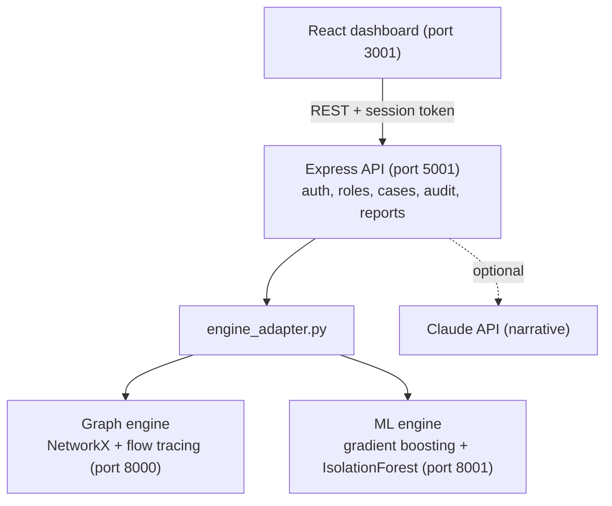

# Cygnus AI: Transaction Network Intelligence for AML

<p align="center">
  
  
  
  
  
  
</p>

AI Dev Fest 2026 (upay track). **Live demo: http://20.219.7.216:3001**

## Contents

1. [Project overview](#1-project-overview)
2. [Features and how AI is used](#2-features-and-how-ai-is-used)
3. [Tech stack](#3-tech-stack)
4. [Requirements](#4-requirements)
5. [Installation and setup](#5-installation-and-setup)
6. [Environment variables](#6-environment-variables)
7. [Run and build commands](#7-run-and-build-commands)
8. [Live deployment](#8-live-deployment)
9. [Testing](#9-testing)
10. [Other configuration](#10-other-configuration)

Also: [Report and slides](#report-and-slides) · [Results](#results) · [Architecture](#architecture) · [API](#rest-api) · [Project structure](#project-structure) · [Limitations](#limitations) · [Disclaimer](#disclaimer)

---

## 1. Project overview

**Problem.** Money launderers on mobile financial services (MFS) split money across many wallets, keep each payment small and wait between hops. Each wallet looks normal on its own, so rules that judge one account or one transaction at a time miss the network: mule rings, layering loops, structuring under limits, hundi (informal remittance) payouts and stolen-device account takeovers.

**Solution.** Cygnus AI turns transactions into a graph (accounts are nodes, payments are edges), follows the money in time order, and scores every account from 0 to 100 using graph pattern detectors, a trained classifier and an anomaly model. Every score comes with plain-language evidence and suggested next steps.

**Purpose.** Give AML analysts at an MFS provider such as upay a ranked, explained list of suspicious networks and a workflow to act on it: investigate, open a case, escalate, decide, export a report. The model ranks and explains. A person decides.

All data is synthetic. No real customer data is used.

## 2. Features and how AI is used

**Detection**

| Feature | What it does | AI / algorithm |
|---|---|---|
| 11 pattern detectors | Fan-in, fan-out, rapid movement, transaction chain, circular flow, structuring, coordinated network, hundi operator, hundi funder, risk-area account takeover, takeover collector | Graph algorithms on NetworkX; time-ordered flow tracing (`ml/temporal_flow.py`) |
| Trained classifier | Rates how closely an account resembles known laundering typologies | Gradient boosting (scikit-learn `HistGradientBoostingClassifier`) on 83 features: transactional, temporal, graph, 2-hop neighbourhood, account type |
| Anomaly model | Flags unusual accounts without labels | `IsolationForest` |
| Composite risk score | `0.40 x ML + 0.40 x Graph + 0.20 x Behaviour`, never lower than 75% of the graph evidence | Explainable weighted score, tier-aware for agents and merchants |
| Per-account explanation | Evidence sentences plus the model's top drivers for that account | Occlusion-based feature attribution |
| AI Investigator | Case briefing: typology, findings, next steps | Rule-based by default; Claude writes the narrative when `ANTHROPIC_API_KEY` is set, using only the computed facts |

Risk tiers: LOW 0-39, MEDIUM 40-69, HIGH 70-89, CRITICAL 90-100.

**Analyst workflow and controls**

- Sign-in with two roles: AML Analyst and Compliance Officer.
- Case management: open a case from an account, add notes, escalate, decide (only a compliance officer can file or close, with a written reason), export an STR/SAR-style report.
- Append-only audit log in which each entry stores the SHA-256 hash of the previous one, with a "Verify chain" check.
- KYC data masked by default; reveal needs the compliance role and a reason, and is audited.
- Follow the Money: interactive network graph with 1-hop and 2-hop exploration and 11 demo scenarios.
- Model Evaluation tab: model comparison, recall by typology, feature importance, bias check, throughput.

## 3. Tech stack

| Layer | Technology |
|---|---|
| Frontend | React 19, Vite 8, Recharts, lucide-react, served by nginx |
| Backend API | Node.js 20, Express 5 (auth, roles, cases, audit log, report export) |
| Graph engine | Python, NetworkX, FastAPI, Uvicorn |
| ML engine | Python, scikit-learn (gradient boosting, random forest, IsolationForest), pandas, NumPy, SciPy, FastAPI |
| AI models | `HistGradientBoostingClassifier` (trained in this repo), `IsolationForest`; optional Anthropic Claude API for the narrative |
| Data | Synthetic generators in `data/synthetic/` (demo scenarios and labelled MFS networks) |
| Infrastructure | Docker, Docker Compose, GitHub Actions CI, Azure VM, optional Vercel for the dashboard |

## 4. Requirements

- **With Docker (recommended):** Docker 20+ and Docker Compose. About 4 GB of free RAM and 3 GB of disk for the images.
- **Without Docker:** Python 3.10+, Node.js 20+, npm.
- Python packages: `scikit-learn`, `scipy`, `pandas`, `numpy`, `networkx`, `fastapi`, `uvicorn`, `pytest` (see `ml/requirements.txt` and `graph-engine/requirements.txt`).
- Node packages are installed by `npm ci` in `backend/` and `frontend/`.
- No GPU is needed. No API key is needed; the Claude narrative is optional.
- Ports 3001, 5001, 8000 and 8001 must be free.

## 5. Installation and setup

### Option A: Docker (recommended)

```bash
git clone https://github.com/ManamiMayoki/CPC_DIU_HACKATHON_2026.git
cd CPC_DIU_HACKATHON_2026
cp .env.example .env          # optional; the defaults work for the demo
docker compose up -d --build  # or: docker-compose up -d --build
```

The first build takes a few minutes and trains the classifier (about 30 seconds). Then open http://localhost:3001 and click **AML Analyst** or **Compliance Officer**.

### Option B: Local, without Docker

```bash
git clone https://github.com/ManamiMayoki/CPC_DIU_HACKATHON_2026.git
cd CPC_DIU_HACKATHON_2026

# 1. Python
pip install -r ml/requirements.txt -r graph-engine/requirements.txt pytest
python -m ml.supervised        # trains and caches the classifier (about 30 s)

# 2. Backend (terminal 1)
cd backend
npm ci
PORT=5000 npm start

# 3. Frontend (terminal 2)
cd frontend
npm ci
npm run dev                    # http://localhost:5173, proxies /api to localhost:5000
```

## 6. Environment variables

All are optional for the demo. Copy `.env.example` to `.env` and fill in what you need. Never commit `.env`.

| Variable | Used by | Purpose | Example placeholder |
|---|---|---|---|
| `CYGNUS_DEMO_MODE` | backend | `true` shows the one-click demo sign-in buttons. Set `false` outside demos. | `true` |
| `CYGNUS_AUTH_SECRET` | backend | Secret that signs session tokens. Empty means a random one at each start. | `<long-random-string>` |
| `CYGNUS_ANALYST_PASSWORD` | backend | Password for the `analyst` account. Empty disables password sign-in for it. | `<choose-a-password>` |
| `CYGNUS_ADMIN_PASSWORD` | backend | Password for the `admin` (compliance officer) account. | `<choose-a-password>` |
| `ANTHROPIC_API_KEY` | backend | Optional. Lets Claude write the AI Investigator narrative. | `<your-anthropic-api-key>` |
| `PORT` | backend | Port the API listens on (default 5000 inside the container). | `5000` |
| `CYGNUS_DATA_DIR` | backend | Folder for the audit log and case files. | `/app/backend/data` |
| `VITE_API_URL` | frontend build | Backend API base URL when the dashboard is hosted elsewhere (for example Vercel). Empty means `/api` on the same origin. | `https://<your-backend-host>/api` |

## 7. Run and build commands

| Task | Command |
|---|---|
| Start everything | `docker compose up -d --build` |
| Stop everything | `docker compose down` |
| Rebuild after a pull | `git pull origin main && docker compose down && docker compose up -d --build` |
| Backend only | `cd backend && npm ci && PORT=5000 npm start` |
| Frontend dev server | `cd frontend && npm ci && npm run dev` |
| Frontend production build | `cd frontend && npm run build` (output in `frontend/dist`) |
| Train the classifier | `python -m ml.supervised` |
| Regenerate demo transactions | `python data/synthetic/generator.py` |
| Regenerate the dashboard's saved state | `python backend/engine_adapter.py --action analyze --out frontend/public/data/initial_state.json` |
| Run the pipeline from Python | `python ml/inference.py` |
| Model evaluation (about 7 minutes) | `python -m ml.evaluation` |
| Throughput and latency benchmark | `python -m ml.benchmark --api http://localhost:5001` |

Local addresses after `docker compose up`:

| Service | Address |
|---|---|
| Dashboard | http://localhost:3001 |
| Backend API | http://localhost:5001/api/health |
| Graph engine docs | http://localhost:8000/docs |
| ML engine docs | http://localhost:8001/docs |

## 8. Live deployment

- **Dashboard and API:** http://20.219.7.216:3001 (API under `/api`, for example http://20.219.7.216:3001/api/health)
- The graph and ML engine docs run on ports 8000 and 8001 of the same host; whether they are reachable depends on the server's firewall.

Sign in with the **AML Analyst** or **Compliance Officer** demo button. No password is needed in demo mode.

The dashboard can also be hosted on Vercel: import the repo, set the root directory to `frontend`, and set `VITE_API_URL` to the backend's `/api` address. Without a backend it runs as a read-only preview on the saved dataset.

## 9. Testing

```bash
# Python: 71 tests (graph, ML, security validation, scenarios, regressions, Phase 2)
pip install -r ml/requirements.txt -r graph-engine/requirements.txt pytest
python -m pytest -q

# Backend API: 10 tests (auth, roles, PII masking, audit chain, case workflow)
cd backend && npm ci && npm test

# Scenario benchmark: 9 controlled scenarios must pass
python evaluate_benchmark.py

# Frontend build and lint
cd frontend && npm ci && npm run build && npm run lint
```

CI (`.github/workflows/ci.yml`) runs the backend tests, the frontend build and the Python tests on every push and pull request to `main`.

To test by hand: open the dashboard, sign in as AML Analyst, pick the **Mule-Ring** scenario in Follow the Money, open a case, add a note and escalate it. Sign out, sign in as Compliance Officer, file the case with a reason, export the STR draft, and open Audit Log to verify the chain.

## 10. Other configuration

- **Risk areas** for the account-takeover detector are a config file, `data/config/risk_areas.json`. The demo uses placeholder zone names; a real deployment would use the list maintained by the provider's fraud team.
- **Optional transaction fields.** The pipeline needs `transaction_id`, `sender_id`, `receiver_id`, `amount`, `timestamp`. The hundi and takeover detectors also use `tx_type`, `location` and `device_id` when present.
- **Persistent data.** Docker Compose mounts the volume `cygnus-data` at `/app/backend/data` so the audit log and cases survive rebuilds.
- **Trained model cache.** `ml/artifacts/gbm_graph.joblib` is created at image build (or by `python -m ml.supervised`) and is not committed.
- **Uploading your own data.** Only the Compliance Officer role can call `POST /api/pipeline/run`.
- **No external accounts or access** are needed to run or test the project.

---

## Report and slides

- [Project report (PDF)](docs/submission/Cygnus-AI-Project-Report.pdf)
- [Presentation slides (PDF)](docs/submission/Cygnus-AI-Slides.pdf)
- [Presentation slides (PowerPoint)](docs/submission/Cygnus-AI-Slides.pptx)

## Results

Measured by `python -m ml.evaluation` on held-out synthetic networks; full detail in [`docs/PHASE2_METRICS.md`](docs/PHASE2_METRICS.md).

| | Rules only | Cygnus graph model |
|---|---:|---:|
| Precision | 26.5% | 94.8% |
| Recall | 32.1% | 83.8% |
| F1 | 0.290 | 0.890 |
| PR-AUC | 0.201 | 0.943 |
| False-positive rate | 2.35% | 0.12% |

- Test set: 423,042 transactions, 39,490 accounts, 1,010 labelled suspicious (848,752 transactions generated in total).
- Rules miss 686 of the 1,010 suspicious accounts; the graph model catches 561 of those.
- 73.6% fewer alerts at equal recall.
- Bias check: legitimate agents wrongly flagged fell from 98.7% (Phase 1 approach) to 0.57%.
- Throughput: 1,061,510 transactions scored in 18.9 seconds on an 8-core laptop.

## Architecture



More in [`docs/architecture.md`](docs/architecture.md).

## REST API

Every endpoint except `/api/health` and `/api/auth/*` needs `Authorization: Bearer <token>`.

| Method | Endpoint | Description |
|---|---|---|
| GET | `/api/health` | Service status |
| POST | `/api/auth/demo` | Demo sign-in, body `{"role": "analyst"}` or `{"role": "admin"}` |
| POST | `/api/auth/login` | Password sign-in |
| GET | `/api/pipeline` | Full graph, accounts, risk distribution |
| GET | `/api/network/:accountId?hops=1` | Neighbourhood subgraph |
| GET | `/api/accounts/:accountId` | Account profile and evidence |
| GET | `/api/accounts/:accountId/profile` | Masked KYC profile |
| POST | `/api/accounts/:accountId/profile/reveal` | Unmasked profile (compliance officer, reason required, audited) |
| GET | `/api/investigate/:accountId` | AI Investigator briefing |
| GET, POST | `/api/cases` | List cases, open a case |
| PATCH | `/api/cases/:id` | Change status or assignee |
| POST | `/api/cases/:id/notes` | Add a note |
| GET | `/api/cases/:id/report` | STR/SAR-style report (HTML, or `?format=json`) |
| GET | `/api/audit` | Audit log and chain check (compliance officer) |
| POST | `/api/pipeline/run` | Run the pipeline on uploaded transactions (compliance officer) |

Schemas are in [`docs/api-contract.md`](docs/api-contract.md).

## Project structure

```
backend/          Express API: server.js, auth.js, cases.js, audit.js, privacy.js, report.js, tests
frontend/         React dashboard: components, services/api.js, saved demo state
graph-engine/     NetworkX graph, pattern detectors, FastAPI service
ml/               validation, features, feature store, flow tracing, context detectors,
                  models, inference, evaluation, benchmark, FastAPI service
data/synthetic/   demo scenario generator, labelled MFS network generator, synthetic KYC profiles
data/config/      risk_areas.json
docs/             architecture, API contract, PHASE2_METRICS.md, evaluation results
tests/            71 Python tests
```

## Limitations

- All data is synthetic, and the simulator was written by the same team as the detectors, so the reported accuracy is an upper bound.
- No upay integration, no real transaction data and no analyst pilot yet.
- The neighbourhood features are fixed 2-hop averages, not a trained graph neural network.
- Neo4j, Kafka streaming, encryption at rest and drift monitoring are planned, not built.
- The workload figures assume 20 minutes of review per alert.

## Disclaimer

This is a hackathon prototype on synthetic data. Its patterns, scores and tiers are indicators to help a human reviewer prioritise. They are not evidence of financial crime and not an official compliance standard. The STR export is a draft and is not submitted anywhere.
