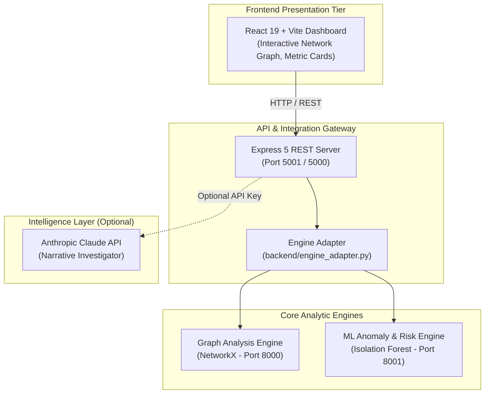

# Cygnus AI — Celestial Intelligence for Financial Forensics & AML Compliance

<p align="center">
  
  
  
  
  
  
  
  
</p>

---

## Table of Contents
- [Executive Overview](#executive-overview)
- [System Architecture](#system-architecture)
- [Core Detection Capabilities](#core-detection-capabilities)
  - [1. Graph Topological Pattern Detectors](#1-graph-topological-pattern-detectors)
  - [2. Machine Learning Anomaly Engine](#2-machine-learning-anomaly-engine)
  - [3. Explainable Composite Risk Scoring](#3-explainable-composite-risk-scoring)
  - [4. AI Investigator & Narrative Synthesis](#4-ai-investigator--narrative-synthesis)
- [Interactive Full-Stack Dashboard](#interactive-full-stack-dashboard)
- [Quick Start Guide](#quick-start-guide)
  - [Option A: Full-Stack with Docker Compose (Recommended)](#option-a-full-stack-with-docker-compose-recommended)
  - [Option B: Local Modular Setup](#option-b-local-modular-setup)
- [Cloud & Vercel Deployment](#cloud--vercel-deployment)
- [REST API & Integration Contract](#rest-api--integration-contract)
- [Comprehensive Test Suite & Benchmarks](#comprehensive-test-suite--benchmarks)
- [Project Directory Structure](#project-directory-structure)
- [Ethical Disclaimer](#ethical-disclaimer)

---

## Executive Overview

**Cygnus AI** is a financial intelligence and forensic analysis platform engineered to detect intricate financial crime topologies and money laundering (AML) operations across complex transactional networks.

Unlike traditional rule-based transaction monitoring systems that evaluate transfers in isolation, Cygnus AI combines **directed graph topological analysis (NetworkX)** with **unsupervised anomaly detection (Isolation Forests)**. This hybrid architecture flags structural evasion strategies—such as layering loops, smurfing (structuring), and mule rings—and synthesizes deterministic, human-auditable case briefings for financial compliance officers and investigators.

```
+-----------------------------------------------------------------------------------+
|                              CYGNUS AI PIPELINE                                   |
|                                                                                   |
|  Synthetic / Raw Transactions                                                     |
|         │                                                                         |
|         ▼                                                                         |
|  [Security & Ingress Validation] (Zero-tolerance negative/NaN/Inf/cycles)         |
|         │                                                                         |
|         ├─────────────────────────────────────────┐                               |
|         ▼                                         ▼                               |
|  [NetworkX Directed MultiGraph]        [Behavioral Feature Extractor]             |
|         │                                         │                               |
|         ▼                                         │                               |
|  [7 Topology Pattern Detectors]                   │                               |
|  (Fan-In, Fan-Out, Cycles, Chains,                │                               |
|   Rapid Flow, Structuring, Clusters)              │                               |
|         │                                         │                               |
|         ▼                                         │                               |
|  [Graph Topological Features]                     │                               |
|         │                                         │                               |
|         └───────────────────┬─────────────────────┘                               |
|                             ▼                                                     |
|                 [Unified ML Feature Vector]                                       |
|                             │                                                     |
|                             ▼                                                     |
|                 [Isolation Forest Model]                                          |
|                             │                                                     |
|                             ▼                                                     |
|             [Explainable Multi-Signal Risk Scorer]                                |
|                 (40% ML + 40% Graph + 20% Behavioral)                             |
|                             │                                                     |
|                             ▼                                                     |
|               [Grounded Evidence Generation]                                      |
|                             │                                                     |
|                             ▼                                                     |
|         [AI Investigator Case Briefings & Interactive UI]                         |
+-----------------------------------------------------------------------------------+
```

---

## System Architecture

The solution is partitioned into modular, independently scalable services:



---

## Core Detection Capabilities

### 1. Graph Topological Pattern Detectors

Cygnus AI enforces rigorous heuristic and temporal checks on the financial graph:

| Pattern Typology | Algorithmic Definition & Heuristic Thresholds | Target Typology |
| :--- | :--- | :--- |
| **Fan-In** | High in-degree ($\ge 4$) with in-to-out ratio $\ge 2.0$, with senders clustered inside a **2-hour burst window**. | Aggregator / Collection Mule |
| **Fan-Out** | Single source dispersing funds to multiple counterparties ($\ge 4$) with out-to-in ratio $\ge 2.0$ inside a **2-hour burst window**. | Distribution Hub / Splitter |
| **Circular Flow** | Directed loops ($A \to B \to C \to A$) spanning 3 to 6 hops, strictly evaluated **in chronological order** within a **6-hour window**, returning $50\% \text{--} 110\%$ of initial value. | Layering & Round-tripping |
| **Transaction Chain** | Linear paths of consecutive funds passing across $\ge 3$ intermediate accounts. | Flow Obfuscation / Pass-through |
| **Rapid Movement** | Intermediary receives $\ge \$1,000$ and dispatches $70\% \text{--} 110\%$ of incoming volume to a third party within **1 hour**. | Pass-Through Mule Account |
| **Structuring (Smurfing)** | $\ge 3$ transactions calibrated just below regulatory reporting limits ($85\% \text{--} 100\%$ of $\$10,000$ threshold) inside a **24-hour window**. | Bank Secrecy Act / CTR Evasion |
| **Coordinated Network** | Dense interconnected clusters and strongly connected subgraphs ($\ge 4$ accounts, edge density $\ge 0.40$). | Organized Financial Crime Ring |

---

### 2. Machine Learning Anomaly Engine

- **Model**: `IsolationForest` configured with deterministic initialization (`random_state=42`) for 100% reproducible scoring across runs.
- **Input Feature Space**: Merged multidimensional matrix capturing:
  - *Graph Topology*: In-degree, out-degree, weighted volumes, cycle participation, chain lengths, counterparty diversity.
  - *Behavioral Velocity*: Inflow/outflow volumes, transaction frequency, velocity, ratio differentials.
- **Normalization**: Min-max calibrated anomaly score mapping anomaly decisions directly into a uniform risk spectrum.

---

### 3. Explainable Composite Risk Scoring

To prevent "black-box" decision-making, Cygnus AI computes a transparent, auditable composite risk score ($0 \text{--} 100$):

$$\text{Composite Risk} = 0.40 \times \text{Score}_{\text{ML}} + 0.40 \times \text{Score}_{\text{Graph}} + 0.20 \times \text{Score}_{\text{Behavioral}}$$

#### Risk Tiers & Actions:
- **LOW ($0 \text{--} 39$)**: Standard operational behavior; routine automated monitoring.
- **MEDIUM ($40 \text{--} 59$)**: Minor deviations or low-frequency anomalous activity.
- **HIGH ($60 \text{--} 79$)**: Multiple corroborating structural or behavioral indicators.
- **CRITICAL ($80 \text{--} 100$)**: High-confidence coordinated evasion (e.g., mule ring, smurfing, circular flow); immediate SAR filing review recommended.

---

### 4. AI Investigator & Narrative Synthesis

- **Deterministic Rule Briefing**: Automatically produces key findings, detected typologies, evidence tables, linked accounts, and recommended regulatory actions without requiring external LLM dependencies.
- **Enhanced LLM Analyst Briefings (Optional)**: When configured with `ANTHROPIC_API_KEY`, the Express backend invokes Claude to synthesize natural-language investigative dossiers strictly grounded in the pipeline's factual output.

---

## Interactive Full-Stack Dashboard

The visual investigation platform provides financial compliance teams with immediate situational awareness:

- **Network Graph Visualizer**: Real-time canvas representing nodes, directed edges, risk-weighted node colors, and multi-hop counterparty exploration.
- **Account Intelligence Panel**: In-depth transaction breakdown, incoming vs. outgoing ratio charts, and algorithmic indicators.
- **Risk Score Explainer**: Transparent breakdown of ML, Graph, and Behavioral contributions.
- **Live Pipeline Simulator**: Submit custom synthetic batches or single JSON payloads to evaluate predictions dynamically.
- **Resilient Offline Fallback**: If backend services are unreachable, the UI seamlessly falls back to precomputed states in `public/data/initial_state.json`.

---

## Quick Start Guide

### Prerequisites
- **Python**: 3.10 or higher
- **Node.js**: v20 or higher
- **Docker & Docker Compose**: Recommended for instant setup

---

### Option A: Full-Stack with Docker Compose (Recommended)

Start the frontend, backend API, Graph Engine, and ML Engine with a single command:

```bash
# Clone the repository
git clone https://github.com/ManamiMayoki/CPC_DIU_HACKATHON_2026.git
cd CPC_DIU_HACKATHON_2026

# Launch all microservices
docker compose up --build
```

#### Running Services:
| Component | Service | Local Address |
| :--- | :--- | :--- |
| **Web Dashboard** | Frontend | [http://localhost:3001](http://localhost:3001) |
| **Integration API** | Backend Gateway | [http://localhost:5001](http://localhost:5001) |
| **Graph Analysis Engine** | Fast Microservice | [http://localhost:8000/docs](http://localhost:8000/docs) |
| **ML Inference Engine** | Fast Microservice | [http://localhost:8001/docs](http://localhost:8001/docs) |

---

### Option B: Local Modular Setup

#### 1. Setup Python Environment
```bash
pip install networkx pandas numpy scikit-learn pytest
```

#### 2. Generate Synthetic Datasets
```bash
python data/synthetic/generator.py
```
*Creates `data/synthetic/transactions_sample.json` simulating 190 transactions across 73 accounts.*

#### 3. Run Forensic Analytics
```bash
# Execute standalone Graph Topology Engine
python graph-engine/engine.py

# Execute full ML Inference and Risk Scoring Pipeline
python ml/inference.py

# Run Scenario Benchmark Evaluation
python evaluate_benchmark.py
```

#### 4. Run Backend & Frontend Locally
```bash
# Terminal 1: Backend
cd backend
npm install
npm run dev

# Terminal 2: Frontend
cd frontend
npm install
npm run dev
```

The frontend will be available at `http://localhost:5173`.

---

## Cloud & Vercel Deployment

The frontend includes full out-of-the-box support for [Vercel](https://vercel.com):

1. **Import Project** into Vercel and set **Root Directory** to `frontend`.
2. **Framework Preset** automatically detects as `Vite`.
3. **Environment Variables**:
   - Set `VITE_API_URL` to your live backend endpoint (e.g., `https://api.yourdomain.com/api`).
   - If deploying as a standalone prototype, leave `VITE_API_URL` blank; the dashboard will automatically run in zero-config offline mode using the pre-computed synthetic dataset.

---

## REST API & Integration Contract

The integration server exposes standardized REST endpoints:

| Method | Endpoint | Description |
| :--- | :--- | :--- |
| `GET` | `/api/health` | Service health status and account count. |
| `GET` | `/api/pipeline` | Complete network graph, risk distributions, and account metrics. |
| `GET` | `/api/network/:accountId?hops=1` | Dynamic neighborhood subgraph for a given entity. |
| `GET` | `/api/accounts/:accountId` | Detailed behavioral profile and evidence record. |
| `GET` | `/api/investigate/:accountId` | Rule-based or LLM-synthesized narrative briefing. |
| `POST` | `/api/pipeline/run` | Execute end-to-end pipeline on arbitrary transaction batches. |

Python developers can also consume the pipeline directly:
```python
from ml.inference import run_pipeline

# transactions = list of dicts with sender_id, receiver_id, amount, timestamp
results = run_pipeline(transactions)
```

Refer to [`docs/api-contract.md`](docs/api-contract.md) and [`docs/architecture.md`](docs/architecture.md) for complete schema specifications.

---

## Comprehensive Test Suite & Benchmarks

The codebase includes **50 automated tests** covering security boundaries, regressions, topological algorithms, and ML determinism:

```bash
python -m pytest tests/ -v
```

| Test Suite | Scope & Verifications | Test Count | Status |
| :--- | :--- | :---: | :---: |
| [`tests/test_graph.py`](tests/test_graph.py) | Graph integrity, node/edge attributes, Fan-In/Out, cycles, chains, rapid movement, clusters | **13** | Passed |
| [`tests/test_ml.py`](tests/test_ml.py) | Behavioral features, Isolation Forest training, normalization, evidence generation | **8** | Passed |
| [`tests/test_scenarios_benchmark.py`](tests/test_scenarios_benchmark.py) | Controlled scenarios (NORMAL, FAN_IN, FAN_OUT, RAPID, CHAIN, CYCLES, STRUCTURING, MULE_RING) | **11** | Passed |
| [`tests/test_security.py`](tests/test_security.py) | Ingress validation, self-transfers, negative amounts, NaN/Inf, timestamp parsing, duplicate IDs | **12** | Passed |
| [`tests/test_regressions.py`](tests/test_regressions.py) | Timezone invariance, cross-seed stability, deterministic sorting | **2** | Passed |
| [`tests/test_upgrade.py`](tests/test_upgrade.py) | Smurfing detector validation, out-of-order loop rejection, offline briefing structure | **4** | Passed |
| **Total Test Coverage** | **Complete Engine & Security Validation** | **50 / 50** | **100% Passed** |

---

## Project Directory Structure

```
.
├── backend/                  # Node.js / Express API gateway & Python adapter
│   ├── src/
│   │   ├── server.js         # REST endpoints & caching layer
│   │   └── investigator.js   # Claude AI case narrative generator
│   └── engine_adapter.py     # High-performance CLI bridge to Python core
├── frontend/                 # React 19 + Vite + Tailwind CSS dashboard
│   ├── src/
│   │   ├── components/       # Graph visualizer, RiskScoreCard, AIInvestigator
│   │   └── services/api.js   # API client with automatic offline fallback
│   ├── vercel.json           # Vercel deployment & SPA routing rewrites
│   └── .env.example          # Environment variable template
├── graph-engine/             # NetworkX graph topology & pattern detectors
│   ├── graph.py              # Directed graph construction
│   ├── patterns.py           # 7 suspicious network pattern detectors
│   ├── features.py           # Topological feature engineering
│   └── engine.py             # Standalone graph analysis orchestrator
├── ml/                       # Machine learning & forensic risk scoring
│   ├── validation.py         # Ingress data sanitizer & security constraints
│   ├── features.py           # Transactional & behavioral feature extraction
│   ├── model.py              # Isolation Forest & composite risk scoring
│   ├── inference.py          # Unified pipeline runner & evidence generator
│   └── investigator.py       # Deterministic rule-based case briefing
├── data/                     # Synthetic transaction generators & samples
├── docs/                     # API contracts & technical architecture specs
├── tests/                    # Pytest suite (50 tests covering all layers)
├── docker-compose.yml        # Multi-container orchestration
└── evaluate_benchmark.py     # Scenario detection benchmark script
```

---

## Ethical Disclaimer

This repository is developed for algorithmic research, benchmarking, and demonstration purposes on synthetic transaction datasets. The topological patterns, risk scores, and classifications generated by this system do **not** constitute legal evidence of financial crime and are designed to assist human compliance analysts in forensic triage, not replace formal regulatory oversight.
## 6. Disclaimer
This software is a synthetic-data hackathon prototype for algorithm research and demonstration. The topological patterns, risk scores, and risk tiers do **NOT** prove financial crime, do **NOT** constitute legal or regulatory evidence, and do **NOT** represent official banking compliance standards.

## Phase 2 additions

Everything below was added after the Phase 1 judge feedback. The measured numbers live in
[`docs/PHASE2_METRICS.md`](docs/PHASE2_METRICS.md), which is generated by the scripts and never typed by hand.

| Area | What was added | Where |
|---|---|---|
| Analyst workflow | Sign-in, case management (open, notes, escalate, decide), exportable STR/SAR-style report | `backend/src/cases.js`, `backend/src/report.js`, Cases tab |
| Access control | Two roles (AML analyst, compliance officer) with a permission matrix; only a compliance officer can file or close a case | `backend/src/auth.js` |
| Audit | Append-only audit log where each entry stores the SHA-256 hash of the previous one; tampering is detected | `backend/src/audit.js`, Audit Log tab |
| Privacy | KYC profile masked in every response; reveal needs the compliance role and a written reason, and is audited | `backend/src/privacy.js` |
| Data | Labelled synthetic Bangladesh-style MFS network generator (about 137,000 transactions per network, six typologies plus legitimate look-alikes) | `data/synthetic/mfs_generator.py` |
| Temporal graph | Time-ordered flow tracing: follows money hop by hop, finds flow chains and loops in one pass | `ml/temporal_flow.py` |
| Features | 83 features per account: transactional, temporal, graph, 2-hop neighbourhood, account type | `ml/feature_store.py` |
| Models | Trained gradient-boosting classifier with per-account drivers, compared against rules, graph detectors, IsolationForest and a random forest | `ml/supervised.py`, `ml/evaluation.py` |
| Account takeover | Risk-area detector scored against each customer's own baseline (usual areas, handset, spending); residents of a risk area are not flagged | `ml/context_risk.py`, `data/config/risk_areas.json` |
| Hundi | Detector for recurring informal remittance payout through an agent or wallet; licensed remittance payout is excluded | `ml/context_risk.py` |
| Fairness | Bias check across account tiers and districts; the score is now tier-aware | `ml/evaluation.py`, `ml/model.py` |
| Scale | Throughput and latency benchmark up to about one million transactions | `ml/benchmark.py` |

### Running it

```bash
docker-compose down && docker-compose up -d --build   # dashboard on http://localhost:3001
```

Open the dashboard and sign in with one of the two demo buttons (AML Analyst or Compliance Officer).
For password sign-in or to turn demo sign-in off, copy `.env.example` to `.env`.

### Tests and evaluation

```bash
python -m pytest -q            # 71 Python tests
cd backend && npm test         # 10 API tests: auth, roles, masking, audit chain, case workflow
python -m ml.evaluation        # model comparison, bias check (about 6 minutes)
python -m ml.benchmark --api http://localhost:5001   # throughput and API latency
```

### Limitations & Future Scope

- **Synthetic Data:** Evaluation uses simulated transactions, not real-world financial data.
- **Validation:** The simulator and detection models were developed by the same team, so reported performance may overestimate real-world accuracy.
- **No Live Integration:** Upay integration, real transaction testing, and analyst pilot validation are pending.
- **Future Development:** Neo4j, Kafka-based streaming, and a trained Graph Neural Network (GNN) are planned enhancements, not yet implemented.
