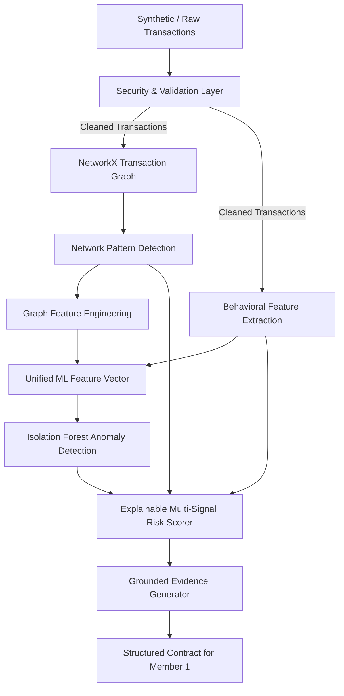

# Cygnus AI Architecture Specification

> **Team Scope:** Member 2 (Graph & Networks) & Member 3 (ML, Risk Scoring, Security & Testing)  
> **Target Consumer:** Member 1 (Product, Frontend & Backend Integration)

---

## 1. System Pipeline Overview

---

## 2. Component Architecture

### Stage 1: Security & Transaction Validation (`ml/validation.py`)
- **Purpose:** Rigorous ingress integrity validation to ensure corrupted or fraudulent data never pollutes graph topology or ML models.
- **Enforced Constraints:**
  - Mandatory field verification (`sender_id`, `receiver_id`, `amount`, `timestamp`).
  - Account ID normalization and self-transfer prevention (`sender == receiver`).
  - Numeric integrity: Rejection of negative amounts, zero amounts, `NaN`, `+Inf`, `-Inf`.
  - Max ceiling protection (`amount <= 1,000,000,000`).
  - Standardized ISO-8601 & Epoch timestamp parsing.
  - Duplicate transaction ID detection.
  - Graceful handling of empty or malformed datasets.

### Stage 2: Transaction Graph Construction (`graph-engine/graph.py`)
- **Technology:** NetworkX (`nx.DiGraph` / `nx.MultiDiGraph`).
- **Graph Topology:**
  - **Nodes:** Unique accounts (`account_id`).
  - **Directed Edges:** Monetary transfers from `sender -> receiver`.
  - **Edge Attributes:** Aggregated transfer `weight` (sum of amounts), transaction `count`, list of individual transaction objects (`transaction_id`, `amount`, `timestamp`).
- **Graph Metrics:** Global node count, edge count, graph density, weakly connected components, strongly connected components.

### Stage 3: Suspicious Network Pattern Detection (`graph-engine/patterns.py`)
Algorithmic detection of structural anomalies without claiming proof of crime:
1. **Fan-In:** Accounts with high in-degree ($\ge 4$) and high in-to-out ratio ($\ge 2.0$), with most senders arriving inside a 2-hour burst window, identifying potential money aggregation hubs.
2. **Fan-Out:** Accounts dispersing funds across many counterparties ($\ge 4$) with high out-to-in ratio ($\ge 2.0$) inside a 2-hour burst window, identifying potential dispersion hubs.
3. **Rapid Fund Movement:** Intermediary accounts that receive at least 1,000 and forward 70% to 110% of it to a third party within 1 hour.
4. **Transaction Chains:** Multi-hop linear paths ($A \to B \to C \to D \dots$) spanning $\ge 3$ consecutive hops.
5. **Circular Flows:** Directed simple cycles ($A \to B \to C \to A$) spanning 3 to 6 hops whose hops happen **in time order** within 6 hours and return $\ge 50\%$ of the value (and no more than 110%), identifying potential layering loops. Cycles are enumerated on integer-relabelled nodes so results are deterministic.
6. **Structuring (smurfing):** $\ge 3$ transfers between 85% and 100% of the reporting threshold (default 10,000) inside 24 hours, flagging the splitting sender and the collecting receiver.
7. **Coordinated Account Networks:** Dense clusters and strongly connected components ($\ge 4$ nodes, density $\ge 0.4$) engaging in high-frequency internal transactions.

### Stage 4: Graph Feature Engineering (`graph-engine/features.py`)
Decoupled extraction of account-level topological signals:
- `in_degree`, `out_degree`, `total_degree`, `degree_ratio`
- `weighted_in_degree`, `weighted_out_degree`, `net_weight_flow`
- `unique_counterparties`
- `fan_in_score`, `fan_out_score`
- `cycle_detected`, `cycle_count`
- `chain_length`, `network_size`, `suspicious_neighbor_count`
- `structuring_detected`, `near_threshold_tx_count`

### Stage 5: Behavioral Feature Extraction (`ml/features.py`)
Statistical behavioral metrics derived per account:
- `transaction_count`, `sent_count`, `received_count`
- `total_incoming`, `total_outgoing`, `net_flow`
- `average_transaction_amount`, `maximum_transaction_amount`, `std_transaction_amount`
- `unique_senders`, `unique_receivers`
- `transaction_velocity` (transactions per active hour)
- `incoming_outgoing_ratio`
- `counterparty_diversity` (unique counterparties per transaction)
- `passthrough_ratio` (inflow vs outflow turnover)
- `amount_volatility` (coefficient of variation of sizing)
- `flow_imbalance_magnitude` (normalized directional drain/funnel)

### Stage 6: Unsupervised Anomaly Detection (`ml/model.py`)
- **Model:** `sklearn.ensemble.IsolationForest` with `RobustScaler` preprocessing.
- **Attributes:** Configurable `contamination`, reproducible `random_state`, outlier prediction (`-1` vs `1`), and decision scores.
- **Robust Anomaly Score Normalization:**
  - Evaluates distance $d = -s / \text{spread}$ from the theoretical Isolation Forest decision boundary ($s = 0.0$).
  - Employs bounded, outlier-resilient exponential/tanh calibration: inliers ($s \ge 0$) map smoothly to $[5.0, 38.0]$ (LOW tier), while true outliers ($s < 0$) scale smoothly to $[50.0, 98.0]$ (MEDIUM/HIGH/CRITICAL).
  - Completely immune to single extreme outliers compressing the dynamic range.
- **Risk Tiers:**
  - **LOW:** $[0, 40)$
  - **MEDIUM:** $[40, 70)$
  - **HIGH:** $[70, 90)$
  - **CRITICAL:** $[90, 100]$

### Stage 7: Population-Calibrated Explainable Risk Scoring (`ml/model.py`)
Mathematical, transparent linear combination without hardcoded brittle thresholds:
$$\text{Risk Score} = 0.40 \times \text{ML Anomaly Score} + 0.40 \times \text{Graph Pattern Score} + 0.20 \times \text{Behavioral Score}$$
- Dynamically calibrates behavioral thresholds against population percentiles ($p_{75}, p_{90}$) of the current dataset.
- Graph pattern points: coordinated cluster 40, circular flow 35, rapid movement 30, structuring 30, fan-in 25, fan-out 25, chain 20, suspicious neighbours 15 (capped at 100).
- Decomposed and reported in every account record (`scoring_breakdown`).

### Stage 8: Evidence Generation & Contract Formatting (`ml/inference.py`)
- Auditable explanation generation strictly grounded in observed metrics and detected patterns.
- Fully formatted JSON object ready for Member 1 ingestion.

### Stage 9: AI Investigator (`ml/investigator.py`, `backend/src/investigator.js`)
- Every account gets a case briefing: typology (for example "Money-mule collection hub"), summary, key findings with concrete numbers, MFS-specific next steps (NID/device/SIM linkage, agent cash-out records, STR to BFIU for critical cases), and linked accounts to open in Follow the Money.
- The briefing is deterministic and built only from computed metrics, so the demo works offline.
- Optionally, the backend asks Claude (`claude-opus-5-5`, structured JSON output) to rewrite the briefing as an analyst narrative, grounded in the same facts. Without `ANTHROPIC_API_KEY`, or on any API error or refusal, the rule-based briefing is used.

---

## 3. Separation of Responsibilities

| Responsibility Area | Team Role | Status |
| :--- | :--- | :--- |
| **Transaction Generator & Scenarios** | Member 2 & 3 | Complete (`data/synthetic/generator.py`) |
| **Ingestion Security Validation** | Member 3 | Complete (`ml/validation.py`) |
| **NetworkX Graph Construction** | Member 2 | Complete (`graph-engine/graph.py`) |
| **Suspicious Topology Detection** | Member 2 | Complete (`graph-engine/patterns.py`) |
| **Graph Feature Extraction** | Member 2 | Complete (`graph-engine/features.py`) |
| **ML Behavioral Feature Engineering** | Member 3 | Complete (`ml/features.py`) |
| **Isolation Forest Anomaly Model** | Member 3 | Complete (`ml/model.py`) |
| **Explainable Composite Scoring** | Member 2 & 3 | Complete (`ml/model.py`) |
| **Evidence / Explanation Generation** | Member 3 | Complete (`ml/inference.py`) |
| **AI Investigator Briefing** | Member 3 | Complete (`ml/investigator.py`, `backend/src/investigator.js`) |
| **Unit & Security Test Suites** | Member 3 | Complete (`tests/`) |
| **API Contract Specification** | Member 2 & 3 | Complete (`docs/api-contract.md`) |
| **Backend Web Server / REST API** | Member 1 | Scope of Member 1 |
| **Frontend React / Dashboard UI** | Member 1 | Scope of Member 1 |
| **Product & Pitch Presentation** | Member 1 | Scope of Member 1 |
